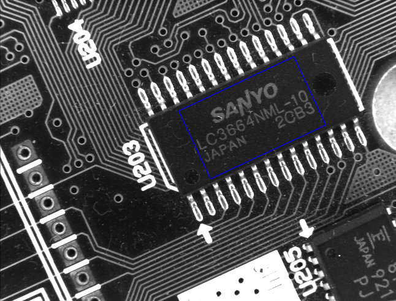

# Template match with gray model(ncc)

## Note: branch [feature-rotate-model](https://github.com/SurfaceMan/gray_match/tree/feature-rotate-model) method 2x faster at matching!

## highlights:
 1. original code based [Fastest_Image_Pattern_Matching](https://github.com/DennisLiu1993/Fastest_Image_Pattern_Matching), you can checkout tag [v1.0](https://github.com/SurfaceMan/gray_match/releases/tag/v1.0) for more details.
 2. refactor simd match process with opencv [Universal intrinsics](https://docs.opencv.org/4.x/df/d91/group__core__hal__intrin.html), have be tested on x86_64(sse),arm(neon),LoongArch(lsx).
 3. support model save/load as binary file
 4. provide pure c interface
 5. support openmp
 6. position with 3x3 subpixel interpolation
 
## usage:
all you need can be found in [main.cpp](main.cpp)

## gallery:

 
